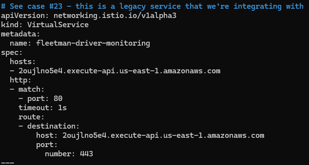

# [Istio Study Week 2] 

## 1.1 Basic Concept of Istio 
Istio Service Mesh는 논리적으로 Data Plain과 Control Plain으로 나누어 집니다.

* Data Plain은 SideCars로서 배포된 지능적인 Proxy(Envoy)의 구성되어 있습니다. 
* Control Plain은 Traffic을 route하기 위해 Proxy들의 관리 및 설정을 합니다.   

아래의 다이어그램은 각 plain을 구성하는 서로 다른 요소를 보여줍니다.
<br /><br />

<br /><br />

## 구성 요소
아래는 Istio의 핵심 구성 요소의 간단한 개요를 제공합니다.

### Envoy
Itsio는 Envoy Proxy의 확장된 버전을 사용합니다. Envoy는 Service Mesh에서 모든 서비스의 InBound/OutBound Traffic을 조정하기 위한 C++로 개발된 고성능의 Proxy입니다.

Envoy Proxy들은 서비스들에 SideCars로서 배포됩니다. Envoy의 built-in된 특성들로 서비스들을 강화시킵니다. 
<br /><br />
예를들어
* 능동적인 서비스 감시
* 로드 벨런싱
* TLS 종료(TLS 종료 프록시를 의미하는 듯 하다.)
* HTTP/2 a및 gRPC proxies
* 서킷 브레이커(Circuit breakers)
* 상태 확인
* Staged rollouts with %-based traffic split
* Fault injection(결함 주입을 통하여 시스템 안정성 및 복구성 검증)
* 풍부한 지표

이 SideCars 배포는 Istio사 정책 결정을 시행하고 전체 망의 행동에 대한 정보를 제공하기 위해 모니터링 시스템으로 보낼 풍부한 지표(telemetry)를 추출할 수 있습니다.

SideCars 프록시 모델은 어떠한 구조의 새설계 또는 코드의 재구성 없이 기존 배포에 Istio 시스템을 넣을 수 있습니다.

Envoy Proxy들에 의해 가능한 Istio 특징 및 역활은 다음과 같습니다.
* Traffic 제어 특성: HTTP, gRPC, WebSocket 그리고 TCP Traffic을 위한 풍부한 Routing 규칙으로 Traffic을 매끄럽게 통제할 수 있습니다.
* Network 회복 특성: retries, failovers, circuit breakers 그리고 fault injection을 설정 할 수 있습니다.
* 보안 및 인증 특성: 보안 정책 시행 및 접근 제어 그리고 설정된 API를 통한 속도 제한이 가능합니다.
* WebAssembly에 기반하여 만들어진 플러그인 모델을 통해 커스텀이 가능한 정책 시행 및 Mesh Traffic을 위한 지표를 생성할 수 있습니다.

### Istiod
Istio는 서비스 탐색, 설정 그리고 인증 관리를 제공합니다.

Istiod는 Envoy의 설정에 따라 Traffic 행동을 통제하고 런타임의 사이드카로 전파하는 고수준의 Routing 규칙으로 변환시킵니다.

Istio는 Kubernetes와 Vm과 같은 다양한 환경에서의 탐색을 지원합니다.

Istio의 Traffic 관리 API를 통하여 Istiod가 Service Mesh 환경에서 Traffic을 더 정밀하게 조정할 수 있도록 Envoy 설정을 정의할 수 있습니다. 

Istiod 보안은 내장된 identity 및 credential 관리로 서비스 간의 그리고 최종 사용자 인증을 할 수 있습니다. Istio를 사용해 Service Mesh내 암호화 되지 않은 Traffic을 향상 시킬 수 있습니다. Istio를 사용함으로서 운영자는 비교적 불안정한 L3 또는 L4 네트워크 identifiers 대신 정책 기반 인증을 할 수 있습니다. 추가적으로 Isito 인증 특성을 이용해 서비스에 접근할 수 있는 사람을 제어할 수 있습니다.

Istiod는 Certificate Authority (CA)처럼 동작하고 Data Plain의 보안 mTLS 통신을 하기 위한 인증서를 발급할 수 있습니다.

### 참고
해당 페이지를 번역: https://istio.io/latest/docs/ops/deployment/architecture/

## 1.2 Istalling Minikube

### 1.2.1 Installing Minikube with Bash file [2024.09.18 기준]
<pre>
<code>
#!/bin/bash

if [ -f /etc/debian_version ]; then
    echo "ubuntu found"
    
    if [ "$(id -u)" -ne 0 ]; then
        echo "Please run this bash in root."
        exit 1
    fi

    sudo apt-get update
    sudo apt-get upgrade -y

    sudo apt-get install curl

    curl -LO https://storage.googleapis.com/minikube/releases/latest/minikube-linux-amd64
    sudo install minikube-linux-amd64 /usr/local/bin/minikube && rm minikube-linux-amd64

    curl -LO "https://dl.k8s.io/release/$(curl -L -s https://dl.k8s.io/release/stable.txt)/bin/linux/amd64/kubectl"
    sudo install -o root -g root -m 0755 kubectl /usr/local/bin/kubectl

    # Add Docker's official GPG key:
    sudo apt-get update
    sudo apt-get install ca-certificates
    sudo install -m 0755 -d /etc/apt/keyrings
    sudo curl -fsSL https://download.docker.com/linux/ubuntu/gpg -o /etc/apt/keyrings/docker.asc
    sudo chmod a+r /etc/apt/keyrings/docker.asc

    # Add the repository to Apt sources:
    echo \
    "deb [arch=$(dpkg --print-architecture) signed-by=/etc/apt/keyrings/docker.asc] https://download.docker.com/linux/ubuntu \
    $(. /etc/os-release && echo "$VERSION_CODENAME") stable" | \
    sudo tee /etc/apt/sources.list.d/docker.list > /dev/null
    sudo apt-get update

    sudo apt-get install docker-ce docker-ce-cli containerd.io docker-buildx-plugin docker-compose-plugin

    elif [ -f /etc/redhat-release ]; then
        echo "rehl found"

    if [ "$(id -u)" -ne 0 ]; then
        echo "Please run this bash in root."
        exit 1
    fi

    sudo yum update -y

    sudo yum install curl 

    curl -LO https://storage.googleapis.com/minikube/releases/latest/minikube-linux-amd64
    sudo install minikube-linux-amd64 /usr/local/bin/minikube && rm minikube-linux-amd64

    curl -LO "https://dl.k8s.io/release/$(curl -L -s https://dl.k8s.io/release/stable.txt)/bin/linux/amd64/kubectl"
    sudo install -o root -g root -m 0755 kubectl /usr/local/bin/kubectl

    sudo yum install -y yum-utils
    sudo yum-config-manager --add-repo https://download.docker.com/linux/centos/docker-ce.repo

    sudo yum install docker-ce docker-ce-cli containerd.io docker-buildx-plugin docker-compose-plugin


else
    echo "Only support Debian/Rehl"
fi

sudo systemctl start docker
</code>
</pre>

### 1.2.2 Start Minikue cluster

<pre>
<code>
minikube config set driver docker
minikube start

#root 계정이 아닌 계정으로 사용
#만약 docker 권한이 없으면 설정 필요
#sudo usermod -aG docker $USER && newgrp docker
</code>
</pre>

## 1.3 Command Set of Hands on Demo

### 1.3.1 Istio Init 
<pre>
<code>
#Installing Istio and Istio plugins
kubectl apply -f ./1-istio-init.yaml
kubectl apply -f ./2-istio-minikube.yaml

#Lastest version of Istio does not make pods anymore.
#It registered as CustomResourceDefinitions.
kubectl get po -n istio-system

#Set kiali User
kubectl apply -f ./3-kiali-secret.yaml
</code>
</pre>


#### [Optional] How to Decode contents in 3-kiali-secret.yaml
```
echo {encoded_string} | base64 -d
```


### 1.3.2 Enabling sidecar injection
SideCar를 injection하는 법
1. yaml로 istio binary 및 app을 실행
   * 추천하지 않음
   * kubernetes definition에 영향이 있을 수 있음
2. Flag를 설정
   * SideCar Injector를 사용해 Flag가 설정된 곳 SideCar 주입
   * Pod를 Scheduling 시 Istio가 탐지 후 Inject
   * Label을 설정해야 동작
   * 기본적으로 NS 단위로 설정


<pre>
<code>
#Make sure you type correctly
kubectl label namespace default istio-injection=enabled

#To check label is set
kubectl describe ns default
</code>
</pre>

### 1.3.3 Deploying an Application
```
kubectl apply -f ./4-application-full-stack.yaml

#Get minikube IP to access Kiali, Jaeger
minikube ip

#Kiali
#{ip}:30080

#Jaeger
#{ip}:31001
```

### 1.3.4 Setting Timeout
#### 일정 시간 응답이 없을 시 timeout 시킨다.



```
#위와 같이 4-application-full-stack.yaml 수정 후 아래 명령어 실행
kubectl apply -f ./4-application-full-stack.yaml
```