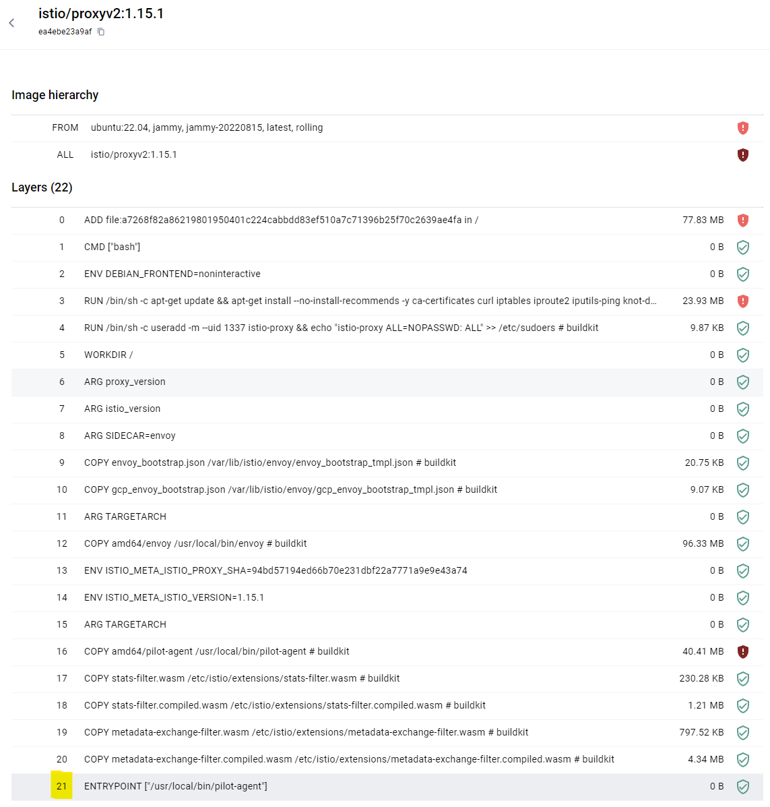
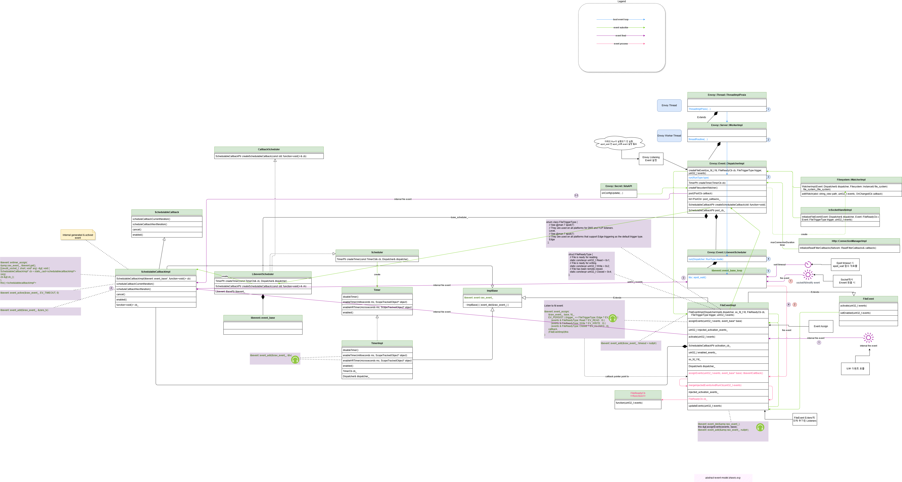

## Istio worker node container

istio는 injection 시 init container 및 Istio proxy container를 생성한다.

자세한 내용은 아래의 명령어로 확인한다.
<pre>
<code>
kubectl describe pod {pod name}
</code>
</pre>

### Init container 개요

먼저 Istio는 pod의 트레픽을 injection될 proxy container로 redirect 하기 위해서 iptables를 조작한다. 이를 위해 Init Container를 사용한다. 

먼저 아래의 명령어를 입력해 init container가 무엇인지 확인한다.

<pre>
<code>
kubectl describe pod {pod name}
</code>
</pre>

그 중에서 init container 부분만 본다면 아래와 같이 나올 것이다. 
<pre>
<code>
Init Containers:
  istio-init:
    Container ID:  docker://78a576d830c5b56f4d8ca92b57fbe0b0941da9da8094feded1c5240f1aea5ead
    Image:         docker.io/istio/proxyv2:1.15.1
    Image ID:      docker-pullable://istio/proxyv2@sha256:7698e960a43b280b99081a505f86f2c73616112a57f21a8a9b6ab91c5ce3a682
    Port:          <none>
    Host Port:     <none>
    Args:
      istio-iptables
      -p
      15001
      -z
      15006
      -u
      1337
      -m
      REDIRECT
      -i
      *
      -x

      -b
      *
      -d
      15090,15021,15020
      --log_output_level=default:info
    State:          Terminated
      Reason:       Completed
      Exit Code:    0
      Started:      Fri, 18 Oct 2024 17:54:51 +0900
      Finished:     Fri, 18 Oct 2024 17:54:51 +0900
    Ready:          True
    Restart Count:  0
    Limits:
      cpu:     2
      memory:  1Gi
    Requests:
      cpu:        10m
      memory:     40Mi
    Environment:  <none>
    Mounts:
      /var/run/secrets/kubernetes.io/serviceaccount from kube-api-access-r7qch (ro)
</code>
</pre>

여기서 container가 하는 일을 보자면 pilot-agent를 Args:에 설정된 인수와 함께 실행시킨다.

pilot-agent가 실행되는 원리는 다음과 같다.

아래의 이미지의 21번쨰 줄 ENTRYPOINT ["/usr/local/bin/pilot-agent"]는 이미지를 실행 시 istio의 pilot-agent 실행파일인 /usr/local/bin/pilot-agent를 실행 시킨다.

[인수에 대한 설명은 이 링크를 보면 된다.](https://istio.io/latest/docs/reference/commands/pilot-agent/#pilot-agent-istio-iptables)

pilot-agent istio-iptables는 실행이 완료되면 0을 리턴하여 종료하므로 Container도 종료된다.

나머지 내용은 아래를 참조하라

[Envoy Proxy가 Application Pod에 injection 되는 상세 과정 <- Automatic만 다룸](https://github.com/ByeongHunKim/cloudclub-istio-skyline/issues/12)

[Envoy Proxy가 어떻게 트래픽을 가로채는가?](https://github.com/ByeongHunKim/cloudclub-istio-skyline/issues/9)

[Iptables 개요 및 원리](https://github.com/ByeongHunKim/Cloudclub-istio-skyline/tree/main/members/opp-13/week4)

  

### proxy container

Istio의 전반적인 구조는 다음과 같다.

[출처](https://istio-insider.mygraphql.com/en/latest/ch1-istio-arch/istio-ports-components.html)

#### Istio-proxy Container 안의 APP

위의 그림에서 보았듯이 Istio-proxy Container안에서는 Pilot agent, Envoy 두 개의 process가 실행된다.

Istio Sidecar Container의 ps 명령어 결과

<pre>
<code>
UID          PID    PPID  C STIME TTY          TIME CMD
istio-p+       1       0  0 08:55 ?        00:00:01 /usr/local/bin/pilot-agent proxy sidecar --domain default.svc.cluster.local --proxyLogLevel=warning --proxyComponentLogLevel=misc:error --log_output_level=default:info --concurrency 2
istio-p+      17       1  0 08:55 ?        00:00:09 /usr/local/bin/envoy -c etc/istio/proxy/envoy-rev.json --drain-time-s 45 --drain-strategy immediate --parent-shutdown-time-s 60 --local-address-ip-version v4 --file-flush-interval-msec 1000 --disable-hot-restart --log-format %Y-%m-%dT%T.%fZ.%l.envoy %n.%v -l warning --component-log-level misc:error --concurrency 2
istio-p+      46       0  0 09:27 pts/0    00:00:00 /bin/bash
istio-p+      69      46  0 10:44 pts/0    00:00:00 ps -ef
</code>
</pre>

pilot-agent, envoy APP은 둘 다 /usr/local/bin에 존재한다. 

이때 pilot-agent의 PID가 1인 이유는 이미지의 ENTRYPOINT가 /usr/local/bin/pilot-agent이기 때문이다. (init container, proxy container 둘 다 같은 이미지를 사용한다.)

Envoy는 PID 1 즉 pilot-agent proxy 명령어에 의하여 실행되었다.

[Istio 시스템이 노출하는 포트에 대한 정보](https://www.anyflow.net/sw-engineer/istio-internals-by-port)

[istio agent 인수에 대한 정보](https://istio.io/latest/docs/reference/commands/pilot-agent/#pilot-agent-proxy)

istio-proxy container 참조 (kubectl describe)
<pre>
<code>
Containers:
  webapp:
    Container ID:   docker://073f1b32bd1abba22f2bcfb93cf7d553e8abcc561b53c07cdae359234e665b2f
    Image:          richardchesterwood/istio-fleetman-webapp-angular:6
    Image ID:       docker-pullable://richardchesterwood/istio-fleetman-webapp-angular@sha256:a7dd53983f3e35445c7a6076f33e61be95c5834780349367a3eb0d51990d0ff9
    Port:           <none>
    Host Port:      <none>
    State:          Running
      Started:      Fri, 18 Oct 2024 17:55:27 +0900
    Ready:          True
    Restart Count:  0
    Environment:
      SPRING_PROFILES_ACTIVE:  production-microservice
    Mounts:
      /var/run/secrets/kubernetes.io/serviceaccount from kube-api-access-r7qch (ro)
  istio-proxy:
    Container ID:  docker://6bb00315cb7a812dada401ee194aaecfa6273a4c1353e4f802ccd5e5c3d010e7
    Image:         docker.io/istio/proxyv2:1.15.1
    Image ID:      docker-pullable://istio/proxyv2@sha256:7698e960a43b280b99081a505f86f2c73616112a57f21a8a9b6ab91c5ce3a682
    Port:          15090/TCP
    Host Port:     0/TCP
    Args:
      proxy
      sidecar
      --domain
      $(POD_NAMESPACE).svc.cluster.local
      --proxyLogLevel=warning
      --proxyComponentLogLevel=misc:error
      --log_output_level=default:info
      --concurrency
      2
    State:          Running
      Started:      Fri, 18 Oct 2024 20:55:20 +0900
    Last State:     Terminated
      Reason:       Completed
      Exit Code:    0
      Started:      Fri, 18 Oct 2024 17:55:27 +0900
      Finished:     Fri, 18 Oct 2024 20:55:19 +0900
    Ready:          True
    Restart Count:  1
    Limits:
      cpu:     2
      memory:  1Gi
    Requests:
      cpu:      10m
      memory:   40Mi
    Readiness:  http-get http://:15021/healthz/ready delay=1s timeout=3s period=2s #success=1 #failure=30
    Environment:
      JWT_POLICY:                    third-party-jwt
      PILOT_CERT_PROVIDER:           istiod
      CA_ADDR:                       istiod.istio-system.svc:15012
      POD_NAME:                      webapp-5cf64d595f-cdqsc (v1:metadata.name)
      POD_NAMESPACE:                 default (v1:metadata.namespace)
      INSTANCE_IP:                    (v1:status.podIP)
      SERVICE_ACCOUNT:                (v1:spec.serviceAccountName)
      HOST_IP:                        (v1:status.hostIP)
      PROXY_CONFIG:                  {}

      ISTIO_META_POD_PORTS:          [
                                     ]
      ISTIO_META_APP_CONTAINERS:     webapp
      ISTIO_META_CLUSTER_ID:         Kubernetes
      ISTIO_META_INTERCEPTION_MODE:  REDIRECT
      ISTIO_META_WORKLOAD_NAME:      webapp
      ISTIO_META_OWNER:              kubernetes://apis/apps/v1/namespaces/default/deployments/webapp
      ISTIO_META_MESH_ID:            cluster.local
      TRUST_DOMAIN:                  cluster.local
    Mounts:
      /etc/istio/pod from istio-podinfo (rw)
      /etc/istio/proxy from istio-envoy (rw)
      /var/lib/istio/data from istio-data (rw)
      /var/run/secrets/credential-uds from credential-socket (rw)
      /var/run/secrets/istio from istiod-ca-cert (rw)
      /var/run/secrets/kubernetes.io/serviceaccount from kube-api-access-r7qch (ro)
      /var/run/secrets/tokens from istio-token (rw)
      /var/run/secrets/workload-spiffe-credentials from workload-certs (rw)
      /var/run/secrets/workload-spiffe-uds from workload-socket (rw)
</code>
</pre>

추가로 etc/istio/proxy에 XDS라는 socket 파일이 있다.
'## srw-rw-rw-인데 리눅스 특성상 socket() 시스템 콜에 의해 생성되었다.

이건 아마 endpoints?
https://my.f5.com/manage/s/article/K000132520

ss -a 시 
Peer Address:Port로 10.97.55.160:15012가 있고 

kubectl exec -it istio-ingressgateway-694859cc5c-qh9r8 -n istio-system -c istio-proxy -- /bin/bash

watch -n 0.1 "ss -a | grep -E 'etc/istio/proxy/XDS|10.97.55.160:15012'"

하면 

tcp   ESTAB     0      0                                        10.244.0.8:59470           10.97.55.160:15012
여기가 39정도 받는다.

https://istio.io/latest/docs/ops/deployment/application-requirements/
이 문서의 istiod의 포트 15012	GRPC로 설정 되있고 istiod의 로컬 ip는 10.97.55.160이므로 맞다.

ip route 시 
istio-proxy@istio-ingressgateway-694859cc5c-qh9r8:/$ ip route
default via 10.244.0.1 dev eth0
10.244.0.0/16 dev eth0 proto kernel scope link src 10.244.0.8
10.244.0.8는 자기 자신의 ip임 다만 다른 경로의 ip를(10.244.0.0/16는 포드 ip 범위) 포워드 시키지 않고 그냥 자기 로컬 ip로 가져온다.

k logs -f webapp-5cf64d595f-cdqsc -c istio-proxy

로 확인한 Envoy 설정

<pre>
<code>
2024-10-18T11:55:20.445512Z     info    Envoy command: [-c etc/istio/proxy/envoy-rev.json --drain-time-s 45 --drain-strategy immediate --parent-shutdown-time-s 60 --local-address-ip-version v4 --file-flush-interval-msec 1000 --disable-hot-restart --log-format %Y-%m-%dT%T.%fZ     %l      envoy %n        %v -l warning --component-log-level misc:error --concurrency 2]
</code>
</pre>

초기 Envoy 구성은 etc/istio/proxy/envoy-rev.json에서 가져옴

이건 자체적으로 있는 파일이 아니라 어디서 가져온 것

docker run --entrypoint="/bin/bash" -it istio/proxyv2:1.15.1

[참조](https://www.envoyproxy.io/docs/envoy/latest/operations/cli)

## Envoy Code 고찰

다음의 글을 기반으로 작성했다.
https://istio-insider.mygraphql.com/en/latest/index.html

Envoy는 Callback design pattern을 사용하는데 이는 일종의 [observer pattern](https://ko.wikipedia.org/wiki/%EC%98%B5%EC%84%9C%EB%B2%84_%ED%8C%A8%ED%84%B4)이다.

Envoy는 서로 다른 compile time을 가지고 있는 어러 Subsystems를 가지고 있다. 주요 모듈은 다음과 같다.

- Buffer - the buffer block
- Api - operating system calls
- Config - Configurations such as XDS.
- Event - Event-driven
- Http - HTTP related
- Http::ConnectionPool - HTTP connection pooling related
- Http1 - HTTP/1.1 related
- Http2 - HTTP/2 related
- Network - IP/TCP/DNS/Socket layer, i.e. OSI L3/L4 related. Includes Envoy Network Filter, Listener, Network::Address and Listener.
- Network::Address - IP address related
- Server - Envoy’s implementation of the Daemon lifecycle as a service.
- Stats - monitoring metrics
- Tcp - TCP and connection pooling related
- Upstream - Upstream related load balancing, health checks, etc.

## Envoy 동작 원리

Envoy는 C언어 라이브러리인 libevent를 사용하여 Linux Kernel의 epoll 이벤트를 감시한다. 

### 여기서 epoll이란?

다중 입출력을 위한 함수로써 여러 fd 를 동시에 차단하면서 fd 중 하나가 차단 없이 읽고 쓸 준비가 될 때 알려준다. select와 poll과는 다르게 실행 할 때 모든 fd들 검사하지 않기 떄문에 병목이 회피된다. 

<pre>
<code>
#inlcude <sys/epoll.h>

Epoll instance 생성 후 fd 반환, 반드시 실행 종료 후 close() 시스템 콜로 닫을 것!
int epoll_create1 (int flags);

//decrecated
int epoll_create (int size);

위에서 생성한 Epoll instance에 fd에 대한 이벤트를 감시하거나 삭제 
int epoll_ctl (int epfd, int op, int fd, struct epoll_event *event);

timeout ms만큼 Epoll instance인 epfd와 연관된 파일의 이벤트를 대기
int epoll_wait (int epfd, struct epoll_event *events, int maxevents, int timeout);
</code>
</pre>

관련해서 O'reilly의 Linux System Programming을 추천한다.

### 아래의 순서와 같이 진행된다. 

  

Envoy는 epoll을 사용하는 libevent를 사용한다.

1. Envoy worker thread는 epoll_wait를 사용하여 관심있는 소켓에 이벤트가 있을 때까지 기다린다. 이때 worker thread는 커널의 Runnable Queue에서 제외되고 worker thread는 잠든다.
2. 만약 커널이 TCP 네트워크 패킷을 받을 시 Event를 트리거 한다. (epoll_wait 참조)
3. 운영체제는 Envoy worker thread를 커널의 Runnable Queue에 올리고 worker thread는 일어나 실행 가능하게 된다. 그러면 운영체제는 worker thread에 CPU 자원을 할당한다.
4. Envoy는 Event List를 분석 후 알맞은 class의 함수를 callback 한다. FileEventImpl::assignEvents 함수
5. Class의 callback 함수는 callback 함수의(FileEventImpl) upperlayer에 있는 함수를 호출한다.
6. Envoy의 실제 Proxy 동작을 실행한다.
7. Callback이 완료 시 1로 돌아간다.

  

만약 libevent 개념을 모르겠다면 아래의 링크를 참조할 것

[현재 참조하고 있는 문서가 제공한 libevent 정보](https://istio-insider.mygraphql.com/en/latest/ch2-envoy/arch/event-driven/libevent.html)

[libevent 공식문서](https://libevent.org/doc/event_8h.html)

[한글 번역본](http://wiki.pchero21.com/index.php/Libevent_R4:_Working_with_events)

  

## Envoy의 Thread 구조

아래의 글을 기반으로 작성하였다.
https://blog.envoyproxy.io/envoy-threading-model-a8d44b922310

Envoy는 크게 3종류의 THread를 사용한다.

- Main: Server의 시작 및 종료, xDS API 제어(DNS, Health check 포함), 일반적인 Cluster 관리, [runtime](https://www.envoyproxy.io/docs/envoy/v1.32.0/configuration/operations/runtime#config-runtime)(Envoy를 재시작 하지 않고 설정을 바꿀 수 있다.), 
  stat flushing, admin, and general process management (signals, hot restart, etc.)의 기능이 있다. 이때 비동기, non-blocking으로 실행된다.
- Worker: Envoy는 모든 Hardware Thread(물리적인 CPU Thread)를 위해 Woker Thread를 생성한다. (--concurrency로 조정 가능) 각각의 Woker THread는 
  non-blocking으로 실행되며 listener에서 감시 및 새 연결 허가, 연결을 위한 filter stack의 instance화 및 연결의 IO lifetime 조정을 한다.
- File flusher: Envoy가 write하는 모든 파일은 독립적인 blocking flush thread가 있다. Worker Thread는 “non-blocking” event loop로 실행되기 때문에 FileSystem Cached files에 작성할 경우 가끔씩 block될 수 있기 때문이다. 
  따라서 worker thread가 file에 작성할 필요가 있을 때 데이터는 in-memory buffer로 이동하고 최종적으로 file flush thread로 온다. 
  
  참조: (O_NONBLOCK은 open() system call의 Flag로서 가능한 경우 파일을 non-block로 연다. 이때 반환받은 fd를 write() system call하면 non-block모드로 쓰기작업을 하는데 블록될 경우 -1을 반환하면서 errno를 EAGAIN으로 설정한다.) 

[스레드 개념](https://velog.io/@hth3396/%ED%95%98%EB%93%9C%EC%9B%A8%EC%96%B4-%EC%8A%A4%EB%A0%88%EB%93%9C%EC%99%80-%EC%86%8C%ED%94%84%ED%8A%B8%EC%9B%A8%EC%96%B4-%EC%8A%A4%EB%A0%88%EB%93%9C)

[여러 스레드 레벨](https://jbluke.tistory.com/106)

  

